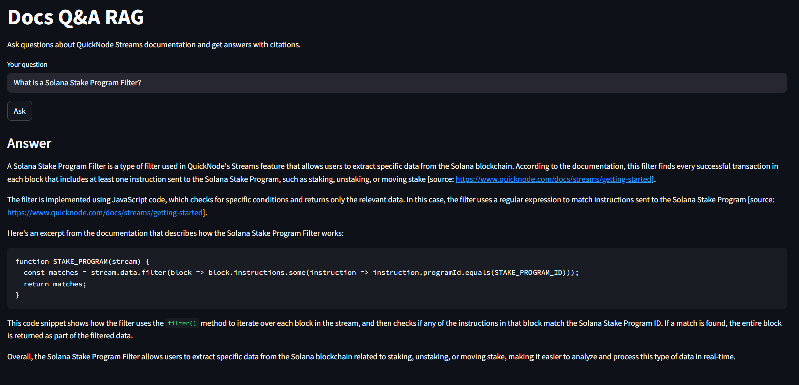

# Docs Q&A RAG chatbot

A small RAG app that answers questions about QuickNode Streams with citations. The content was crawled and ingested from [QuickNode docs](https://www.quicknode.com/docs/streams/getting-started) using a Python script.

## Tech stack

- FastAPI (back-end API)
- LangChain + Chroma (vector store)
- Streamlit (UI)
- Docker Compose for deployment

## Quickstart: Run with Docker Compose

Deploy the app:

```bash
# from repo root
docker compose up -d --build
``` 

- UI: <http://localhost:8501>
- API: <http://localhost:8000/docs>

Verify it's running:

```bash
curl -sS http://localhost:8000/health || curl -I http://localhost:8000/docs
```

Docker commands:

```bash
docker compose restart ui
docker compose restart api
docker compose stop
docker compose down
# WARNING: this would delete named volumes (and your DB if you used one)
# docker compose down -v
```

>**Note**: First question may take longer while models warm up; subsequent queries are faster.

## Screenshot



## Ingest/update docs

This project stores content directly in Chroma at `data/db/` (you’ll see `chroma.sqlite3` and `.bin` shards). You can crawl more pages with the Python script:

```bash
python ingest/web_ingest_quicknode_streams.py
```

> **Note**: `data/docs/` is optional. Keep the folder (can be empty) so Docker binds it cleanly. Add `.md` files there only if you plan to run a separate ingest script that embeds them into Chroma.

## Project layout

```
docs-rag-agent/
├─ app/
│  ├─ main.py            # FastAPI app with /ask
│  ├─ chains.py          # embeddings, vectorstore, RAG chain
│  ├─ config.py
│  └─ __init__.py
├─ ui/
│  └─ app.py             # Streamlit client (reads API_URL env var)
├─ ingest/
│  ├─ web_ingest_quicknode_streams.py  # crawler → Chroma
│  └─ (optional) ingest_md.py          # local .md → Chroma
├─ data/
│  ├─ docs/              # optional; can be empty (keep folder present)
│  └─ db/                # Chroma DB (persisted)
├─ docker-compose.yml
├─ dockerfile.api        # API container
├─ dockerfile.ui         # UI container (Streamlit)
├─ requirements.txt
└─ .env.example
```
